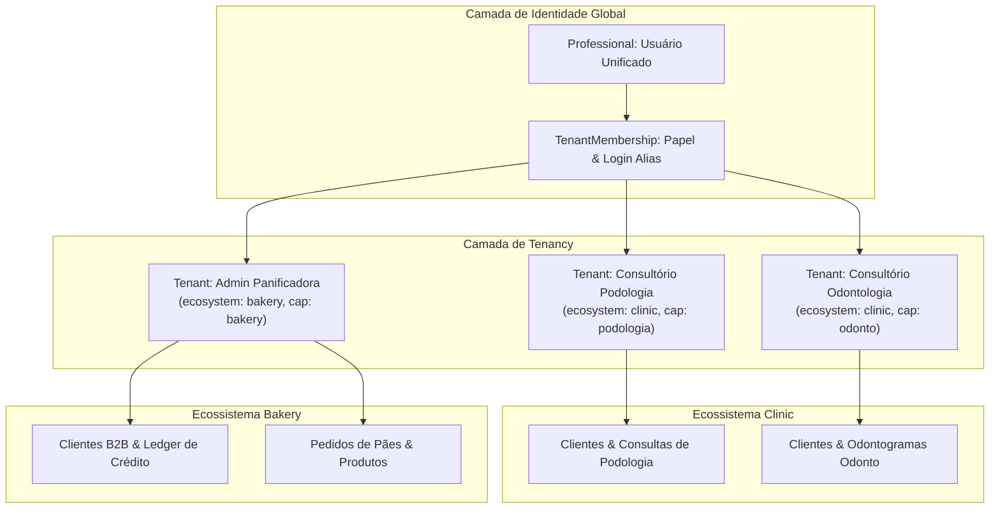

# Arquitetura do Backend — EB System (Multi-Tenant & Multi-Ecosystem)

Este documento descreve a estrutura organizacional, as responsabilidades de cada diretório e os princípios arquiteturais que regem o backend do **EB System**.

---

## 1. Visão Geral da Arquitetura

O sistema é estruturado como um **Modular Monolith (Monólito Modular)** desenvolvido em Python/Django REST Framework, projetado com a arquitetura:
> **1 Backend Centralizado ➡️ N Ecossistemas e Frontends Especializados**

### Princípios Fundamentais:
1. **Multi-Tenancy Lógico Estrito:** Todos os dados clínicos, comerciais e operacionais pertencem a um `Tenant` (empresa/consultório). O isolamento é garantido por `tenant_id` em nível de banco de dados e filtros de queryset.
2. **Separação de Domínios por Ecossistema:** Cada nicho de negócio possui seu próprio aplicativo (`apps/clinic/`, `apps/bakery/`), com regras e modelos de dados 100% isolados.
3. **Regra de Ouro de Desacoplamento:** Módulos de nicho **nunca importam código uns dos outros** (`clinic` não conhece `bakery`, e `bakery` não conhece `clinic`). Toda comunicação compartilhada ocorre exclusivamente através do núcleo global (`authentication`, `notifications`, `utils` e `core`).

---

## 2. Árvore de Diretórios do Backend

```text
backend/
├── manage.py                          # Ponto de entrada de comandos administrativos do Django
├── dev.sh                             # Script local para subir servidor Django + loop de background
├── requirements.txt                   # Dependências Python do projeto
├── pytest.ini                         # Configurações do executor de testes automatizados
│
├── core/                              # Configuração Central e Infraestrutura do Django
│   ├── settings/                      # Configurações modulares (12-Factor App)
│   │   ├── _helpers.py                # Helpers para parsing de variáveis de ambiente
│   │   ├── base.py                    # Configuração base comum (apps instalados, i18n)
│   │   ├── database.py                # Configuração do banco PostgreSQL
│   │   ├── auth.py                    # Configuração de JWT, senhas e modelos de usuário
│   │   ├── cors.py                    # Políticas de CORS e hosts permitidos por frontend
│   │   ├── security.py                # Headers HTTP, HTTPS redirect, cookies seguros
│   │   ├── services.py                # Integrações externas (Telegram, ViaCEP)
│   │   ├── email.py                   # Configurações de envio SMTP
│   │   ├── logging.py                 # Formatação de logs estruturados
│   │   └── production.py              # Overrides para o ambiente em nuvem (Render)
│   ├── middleware.py                  # Middlewares customizados (timing, versão, lock de mutação)
│   ├── urls.py                        # Roteador central que distribui requisições para cada app
│   ├── asgi.py                        # Ponto de entrada ASGI (assíncrono)
│   └── wsgi.py                        # Ponto de entrada WSGI (síncrono/produção)
│
├── apps/                              # Módulos de Aplicação do Sistema
│   │
│   ├── authentication/                # [GLOBAL] Identidade, Permissões e Multi-Tenancy
│   │   ├── models/
│   │   │   ├── register_models.py     # Professional (usuário global), DeviceSession
│   │   │   └── tenancy_models.py      # Tenant (empresa/clínica) e TenantMembership (papéis)
│   │   ├── views/                     # Autenticação JWT, sessões ativas e perfil
│   │   ├── serializers/               # Serialização de login, tenants, membros e credenciais
│   │   ├── services/                  # Lógica de emissão de tokens JWT
│   │   └── urls.py                    # Rotas sob o prefixo /register/ e /token/
│   │
│   ├── notifications/                 # [GLOBAL] Motor Central de Mensageria e Alertas
│   │   ├── models.py                  # TelegramProfessionalLink (vínculo de bot/chat_id por tenant)
│   │   ├── admin.py                   # Gestão dos links do Telegram no Django Admin
│   │   └── services/
│   │       └── telegram_client.py     # Cliente HTTP para API do Telegram (mensagens, verificação de bot)
│   │
│   ├── clinic/                        # [ECOSSISTEMA 1] Gestão de Saúde, Consultórios e Procedimentos
│   │   ├── models/
│   │   │   ├── clients.py             # Pacientes/Clientes com isolamento por Tenant
│   │   │   ├── agenda.py              # Agendamentos, lembretes e cobranças vinculadas
│   │   │   ├── inventory.py           # Catálogo de Serviços, Materiais e Produtos clínicos
│   │   │   ├── treatment.py           # Planos de Tratamento e Sessões de Atendimento
│   │   │   ├── podologia.py           # Contexto e procedimentos específicos de Podologia (dedo/região)
│   │   │   └── odonto.py              # Procedimentos Odontológicos e Notação Dentária FDI
│   │   ├── views/                     # APIs para agenda, prontuário, catálogo e anamnese pública
│   │   ├── serializers/               # Serializadores para cada especialidade clínica
│   │   └── urls.py                    # Rotas clínicas (/agenda/, /clinic/, /inventory/)
│   │
│   └── bakery/                        # [ECOSSISTEMA 2] Gestão de Panificação, Vendas B2B e Crédito
│       ├── models/
│       │   ├── customer.py            # Clientes/Compradores B2B, status (PENDING/APPROVED/BLOCKED)
│       │   ├── product.py             # Produtos embalados (hot-dog, hambúrguer, pães)
│       │   ├── order.py               # Pedidos de compra e itens do pedido
│       │   ├── ledger.py              # CreditLedgerEntry: extrato financeiro e limite rotativo
│       │   └── audit.py               # Log de auditoria para alterações cadastrais e de crédito
│       ├── views/                     # APIs para clientes, pedidos, catálogo e aprovação
│       ├── serializers/               # Serializadores de validação de limite e pedidos
│       └── urls.py                    # Rotas comerciais sob /api/v1/bakery/
│
├── utils/                             # Utilitários Globais Compartilhados
│   ├── cep_lookup.py                  # Integração e consulta de endereço via ViaCEP com cache
│   ├── permissions.py                 # Permissões REST (HasTenantCapability, IsTenantMember)
│   └── pagination.py                  # Classes de paginação customizada para listas
│
├── scripts/                           # Automações e Operações em Banco de Dados
│   ├── data-audit/                    # Scripts de verificação de integridade de dados legados
│   ├── data-fix/                      # Scripts para ajustes e normalização de registros
│
├── docs/                              # Documentação Técnica e Operacional
│   ├── reset_database_loc.md          # Passo a passo de reset e bootstrap local do banco
│   ├── architecture-and-app-routing.md # Diretrizes de roteamento entre frontends e backend
│   └── anamnesis-field-maintenance-guide.md # Guia de campos e formulários de anamnese
│
└── tests/                             # Suíte de Testes Automatizados de Integração
    ├── test_appointment_state_rules.py # Validações de máquina de estados de agendamentos
    ├── test_bakery_lookup_cep.py      # Testes de consulta de CEP e preenchimento no Bakery
    └── test_anamnesis_token_endpoints.py # Testes dos links de anamnese pública
```

---

## 3. Descrição Detalhada das Pastas

### 3.1 `core/` — O Motor de Infraestrutura
Centraliza a orquestração do Django. Todas as configurações foram extraídas de um arquivo único para o subdiretório `core/settings/`, separando concerns de banco de dados, CORS, autenticação e ambiente de produção.
- **`middleware.py`**: Intercepta as requisições para monitorar latência (`QueryTimingMiddleware`), anexar metadados de versão (`VersionHeaderMiddleware`) e aplicar bloqueio seletivo de mutações em staging (`OnlineMutationLockMiddleware`).
- **`urls.py`**: Ponto único de roteamento do servidor, delegando os caminhos para as APIs corretas de cada ecossistema.

### 3.2 `apps/authentication/` — Identidade e Multi-Tenancy Unificado
Responsável por responder: **"Quem é você e a qual empresa você tem acesso?"**.
- **`Professional`**: Modelo de usuário unificado herdado de `AbstractBaseUser`. Armazena credenciais (e-mail, senha criptografada), dados pessoais e telefone celular para contato.
- **Autenticação Simplificada e Controlada**: Login por e-mail e senha fixa gerenciada diretamente pelo administrador/superuser. TOTP e WebAuthn/Face ID foram removidos para evitar atritos de sincronismo e complexidade de infraestrutura; o preenchimento biométrico fica a cargo do gerenciador nativo de senhas de cada navegador/sistema operacional.
- **Governança Estrita de Acesso**: Nenhum `Tenant` ou `TenantMembership` é provisionado automaticamente. O provisionamento é 100% manual via Django Admin ou comando de setup, garantindo controle total dos profissionais e empresas cadastradas.
- **Sessões e Dispositivos (`DeviceSession`)**: Rastreamento de sessões ativas por dispositivo físico, com limite configurável de conexões simultâneas para mitigar compartilhamento indevido de contas.
- **`Tenant`**: Entidade central de multi-tenancy. Representa a clínica ou a empresa. Possui atributos `slug` (identificador na URL), `ecosystem` (`clinic`, `bakery`, etc.) e `capabilities` (dicionário JSON que liga/desliga funcionalidades).
- **`TenantMembership`**: Tabela de relacionamento entre `Professional` e `Tenant`, definindo a função do usuário (`owner`, `admin`, `member`, `guest`) e seu apelido de login rápido (`login_alias`).

### 3.3 `apps/clinic/` — Domínio de Saúde (Clínica)
Encapsula toda a lógica de atendimento clínico.
- **Agendamentos (`agenda.py`)**: Compromissos médicos, intervalos e controle de estados (`scheduled`, `done`, `canceled`).
- **Prontuários e Anamneses (`treatment.py`, `clients.py`)**: Ficha cadastral e registros clínicos estruturados.
- **Especialidades com Isolamento**: Submódulos para Podologia (dedos e regiões plantares) e Odontologia (dentição decídua/permanente e faces anatômicas na notação FDI).
- **Orçamentos sem PIX**: O Clinic compartilha orçamentos por WhatsApp com itens, total e observações, sem armazenar chaves PIX ou gerar payload de pagamento.

### 3.4 `apps/bakery/` — Domínio de Panificação e Distribuição B2B
Transforma fluxos de venda e distribuição comercial em processos digitais rápidos:
- **Clientes B2B (`customer.py`)**: Mercados e padarias atendidos, operando com limite de compra a prazo.
- **Controle de Limite Rotativo (`ledger.py`)**: Extrato de débitos (novos pedidos) e créditos (pagamentos efetuados), calculando saldo em tempo real.
- **Gestão de Pedidos (`order.py`, `product.py`)**: Entrada ágil de pedidos de pães e produtos embalados, com validação automática de crédito disponível.
- **Pagamentos Cíclicos**: O status de pagamento e a recomposição do limite de crédito pertencem exclusivamente ao `CreditLedgerEntry` da Bakery; não são compartilhados com o Clinic.

### 3.5 `apps/notifications/` — Mensageria Centralizada (Telegram)
Módulo agnóstico e compartilhado para comunicação externa:
- Permite que qualquer profissional conecte seu próprio Bot do Telegram através de um handshake seguro via token assinado HMAC.
- O registro `TelegramProfessionalLink` vincula o chat do profissional diretamente ao seu `tenant_id`, assegurando isolamento multi-tenant das mensagens.
- Na primeira conexão bem-sucedida, o bot envia uma mensagem de confirmação exibindo o telefone celular cadastrado no perfil do profissional.
- Dispara notificações de compromissos para clínicas e notificações em tempo real para padarias (novos pedidos e novos clientes pendentes de aprovação).

---

## 4. Comportamento do Sistema e Modelo de Domínios / Ecossistemas

O sistema utiliza o padrão **Single Database / Multi-Tenant com Particionamento Lógico**:



### 4.1 Comportamento do Ecossistema `clinic`
- **Tenants Distintos por Especialidade:** Podologia e Odontologia são clínicas conceitualmente e legalmente diferentes. Cada uma opera em seu próprio `Tenant` (`consultorio-podologia` e `consultorio-odontologia`).
- **Isolamento de Clientes:** A restrição de duplicidade de telefone (`uniq_client_tenant_phone`) é restrita ao `Tenant`. Um mesmo paciente pode existir na Podologia e na Odontologia com prontuários completamente separados.
- **Capacidades Ativas (`capabilities`):** A interface e os endpoints adaptam os formulários de acordo com o JSON de capacidades:
  - `{"clinic": true, "podologia": true}` ➡️ Exibe contexto podológico e seleção de dedos no SVG.
  - `{"clinic": true, "odonto": true}` ➡️ Exibe odontograma com mapeamento FDI e cálculo de orçamentos.
- **Proteção de PII no Logout:** O frontend centraliza a limpeza de estado local (`clearStoredAuth` / `clearStaleLocalStorageKeys`). No encerramento da sessão (manual ou expiração), todas as chaves de nomes de clientes (`client.name.*`) e resquícios legados são expurgados do `localStorage`, prevenindo vazamento de dados em terminais compartilhados.

### 4.2 Comportamento do Ecossistema `bakery`
- **Público Alvo B2B:** Os compradores são padarias, minimercados e lanchonetes.
- **Auto-Cadastro Público com Tenant:** O endpoint `/api/v1/bakery/customers/register/` opera com permissão pública (`AllowAny`), recebendo dados cadastrais e `tenant_slug`. O cliente é registrado com status inicial `PENDENTE`.
- **Aprovação Segura pelo Administrador:** A ativação do cliente exige confirmação da senha do administrador (`admin_password`) e atribuição obrigatória de limite de crédito rotativo.
- **Autenticação Direta:** Utiliza o endpoint `/api/v1/auth/bakery/login/`, recebendo `login` (e-mail ou alias), `password` e `tenant_slug`.
- **Motor de Crédito (Ledger):** Ao emitir um pedido, o sistema valida se `saldo_atual + valor_pedido <= limite_de_credito`. A cada pagamento recebido pelo administrador, um lançamento positivo no `CreditLedgerEntry` restaura a capacidade de compra do cliente.

---

## 5. Roteamento de Portas e Comunicação com Frontends

Em ambiente local de desenvolvimento, os frontends e o backend operam simultaneamente sem conflito:

| Aplicação | Tecnologia | Porta Local | Prefixo de Rotas Backend | Autenticação Utilizada |
| :--- | :--- | :--- | :--- | :--- |
| **Backend Django** | Python / DRF | `8000` | `/` e `/admin/` | Sessão Django / JWT |
| **Frontend Clinic** | Vite / React | `5173` | `/register/`, `/agenda/`, `/clinic/`, `/inventory/` | Bearer JWT (`/token/`) |
| **Frontend Bakery** | Vite / React | `5174` | `/api/v1/bakery/`, `/api/v1/auth/bakery/` | Bearer JWT (`/api/v1/auth/bakery/login/`) |

Ambos os frontends usam proxies internos no `vite.config.ts` apontando para `http://localhost:8000`, eliminando a necessidade de expor credenciais no cliente e mantendo conformidade com as regras de CORS.


## 🔍 Revisão (pré-deploy)

- Validar que todos os modelos possuem `tenant_id`.
- Garantir que middlewares aplicam `tenant_id` em todas as requisições.
- Verificar se cada domínio (`clinic`, `bakery`) mantém isolamento completo.
- Confirmar que APIs de mensagens incluem `tenant_id` no payload.
- Sugerir otimizações de performance em queries e endpoints.
- Revisar se o `core` está livre de dependências cruzadas entre apps.
- Checar se o `authentication` mantém consistência entre `Professional`, `Tenant` e `TenantMembership`.
- Garantir que o roteamento e autenticação dos frontends seguem as regras de CORS e segurança.
