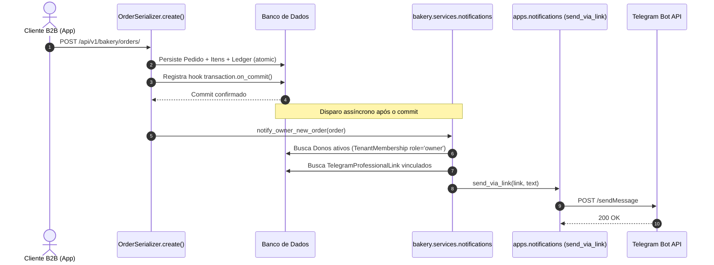

# 🥖 Bakery Services — Integração com Motor de Notificações Global

## 1. Visão Geral
Este documento descreve como o ecossistema `apps.bakery` consome a infraestrutura global de mensageria (`apps.notifications`) de forma desacoplada, preservando 100% o isolamento das regras de negócio de panificação e distribuição.

---

## 2. Ponto de Integração: `apps/bakery/services/notifications.py`

### `notify_owner_new_order(order: Order) -> None`
Notifica os proprietários da unidade de panificação sempre que um novo pedido é confirmado/criado na plataforma.

---

## 3. Diretrizes de Projeto e Boas Práticas

### 1. Chamada estritamente após o commit (`transaction.on_commit`)
- **Regra:** A criação de pedidos na padaria envolve bloqueio pessimista (`select_for_update`) na tabela de limites de crédito (`BakeryCustomer`).
- **Solução:** `notify_owner_new_order` é acionado dentro de `transaction.on_commit(lambda: notify_owner_new_order(order))`. Nenhuma chamada HTTP externa ao Telegram ocorre enquanto locks de banco de dados estiverem abertos.

### 2. Disparo Defensivo / Best-Effort
- O envio do Telegram nunca interrompe ou cancela a criação do pedido.
- Qualquer exceção de rede (`TelegramDeliveryError`, timeout, bot desconfigurado) é interceptada internamente e registrada em log de aviso (`logger.warning`), permitindo que a resposta ao cliente seja sempre 201 Created.

### 3. Resolução Multi-Tenant dos Proprietários
- O serviço busca `TenantMembership` com filtro `tenant_id=order.tenant_id, role=Role.OWNER, is_active=True`.
- Em seguida, busca os vínculos em `TelegramProfessionalLink` correspondentes àqueles proprietários para o respectivo tenant.
- Se o dono não conectou o Telegram ou desativou o vínculo, a mensagem é silenciosamente ignorada.

---

## 4. Relação com o Frontend (`frontend-bakery`)
- Os administradores autenticados da padaria gerenciam sua conexão na aba **Configurações** (`SettingsPage.tsx`).
- O frontend consome os endpoints globais de autoatendimento (`/register/professionals/telegram/*`) reutilizando o token do admin (`bread_admin_token`).
- Não foi necessária nenhuma rota customizada dentro de `/api/v1/bakery/` para pareamento do bot.
